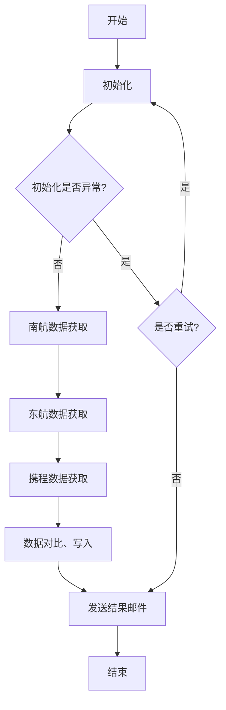

# 剑气高级案例分析与最佳实践

> 基于真实企业级RPA项目的深度技术分析

## 📋 目录

- [案例概览](#案例概览)
- [项目架构分析](#项目架构分析)
- [核心技术要点](#核心技术要点)
- [代码模式库](#代码模式库)
- [最佳实践总结](#最佳实践总结)
- [常见问题解决](#常见问题解决)

---

## 案例概览

### 项目信息

**项目名称**：机票查询RPA自动化流程  
**开发单位**：北京玖卓科技  
**开发者**：张建琦 (15801023818)  
**开发时间**：2020-2021年  
**剑气版本**：5.3.0 / 5.5.0  
**项目类型**：企业级数据采集与对比系统

### 业务场景

实现**多平台机票价格智能对比**，自动从三大航空平台抓取数据并生成对比报告：

1. **南方航空官网** (csair.com)
2. **东方航空官网** (ceair.com)
3. **携程旅行网** (ctrip.com)

### 核心价值

- ✅ 自动化数据采集，节省人工成本
- ✅ 多平台价格对比，找到最优方案
- ✅ 结构化数据输出，便于分析决策
- ✅ 邮件自动通知，及时获取结果

---

## 项目架构分析

### 1. 项目结构

北京玖卓科技_张建琦_15801023818/
├── 1.设计/                          # 设计文档
│   ├── UiBot实施实践RPA项目整体设计.docx
│   └── UiBot实施实践RPA项目飞机票查询流程设计.docx
├── 2.编码/                          # 代码实现
│   ├── 机票查询_人机交互/           # 人机交互版本
│   ├── 机票查询_无人值守/           # 无人值守版本
│   └── 机票查询_无人值守_5.3.0/     # 5.3.0版本
├── 3.测试/                          # 测试相关
├── 4.上线/                          # 上线部署
└── 5.截图/                          # 项目截图
```

### 2. 代码模块结构

```
机票查询_人机交互/
├── 机票查询_人机交互.flow           # 主流程文件
├── 初始化.task                      # 环境初始化模块
├── 南航模块.task                    # 南航数据采集
├── 东航模块.task                    # 东航数据采集
├── 携程模块.task                    # 携程数据采集
├── 数据对比模块.task                # 价格对比与处理
├── 发送结果邮件.task                # 结果通知
├── PublicBlock.task                 # 公共函数库
├── res/                             # 资源文件
│   ├── config/                      # 配置文件
│   │   ├── Config.ini               # 配置参数
│   │   └── 飞机票查询练习项目输出模板.xlsx
│   └── *.png                        # UI元素图像
├── log/                             # 运行日志
└── extend/                          # 扩展库
    ├── DotNet/
    ├── Python/
    └── Lua/
```

### 3. 主流程架构



### 4. 全局变量设计

```javascript
// 全局变量字典
g_dictGlobal = {
    "isEx": False,              // 流程异常标识
    "maxRetryNum": 3,           // 最大重试次数
    "xcAddr": "携程地址",        // 携程URL
    "csAddr": "南航地址",        // 南航URL
    "ceAddr": "东航地址",        // 东航URL
    "departure": "广州",         // 出发地
    "arrival": "北京",           // 到达地
    "weatherApi": "天气接口",    // 天气API
    "userName": "UiBot",         // 用户名
    "excelName": "输出文件名",   // Excel文件名
    "server": "smtp.qq.com",     // 邮件服务器
    "port": 25,                  // 邮件端口
    "passport": "发送邮箱",      // 发送邮箱
    "password": "邮箱密码",      // 邮箱密码
    "sendAddr": "接收邮箱",      // 接收邮箱
    "csData": [],                // 南航数据
    "ceData": [],                // 东航数据
    "xcData": []                 // 携程数据
}

// 重试计数器
g_iRetryNum = 0
```

---

## 核心技术要点

### 1. 智能价格对比算法

**核心逻辑**：同航班号价格对比，自动选择最低价格

```vb
/*南航数据与携程数据对比*/
For Each csValue In csData
    csValue[5] = CInt(csValue[5])
    For Each xcValue In xcData
        xcValue[2] = CInt(xcValue[2])
        // 排除携程数据里南航以外信息
        If xcValue[0] = '南方航空'
            eachArr = []
            // 选择同一航班数据
            If StartsWith(xcValue[1], csValue[2])
                // 价格对比，如果携程数据小于等于南航，选携程的数据来源，否则选南航
                If CInt(xcValue[2]) > CInt(csValue[5])
                    price = csValue[5]
                    source = '南航'
                Else
                    price = xcValue[2]
                    source = '携程'
                End If
                eachArr = [source, '南方航空', csValue[2], csValue[3], 
                          csValue[4], price, csValue[6], csValue[7], csValue[8]]
                csDataArr = push(csDataArr, eachArr)
            End If
        End If
    Next
Next
```

**技术亮点**：
- ✅ 按航班号精确匹配（StartsWith函数）
- ✅ 自动选择最低价格
- ✅ 记录数据来源（南航/东航/携程）
- ✅ 处理平台独有航班数据

### 2. Web自动化技术

**浏览器控制与智能等待**

```vb
// Chrome浏览器控制
hWeb = WebBrowser.Create("chrome", g_dictGlobal["csAddr"], 30000)
Window.Show({"wnd":[{"cls":"Chrome_WidgetWin_1"}]}, "max")

// 智能等待：通过点击元素判断页面加载完成
Mouse.Action({"html":[{"tag":"LI","parentid":"commonbox"}]}, 
             "left", "click", 10000)
```

**元素定位技术栈**：
- HTML元素定位（tag、id、class、css-selector）
- 图像识别辅助定位（@res图片资源）
- 混合定位策略（HTML + 图像）

**数据抓取示例**：

```vb
// 使用DataScrap进行结构化数据抓取
arrayData = UiElement.DataScrap(
    {"html":[{"id":"zls-common","tag":"DIV"}]},
    {"Columns":[
        {"props":["text"], "selecors":[...]},  // 航班信息
        {"props":["text"], "selecors":[...]}   // 价格信息
    ], "ExtractTable":0},
    {"iMaxNumberOfPage":5, "iDelayBetweenMS":1000}
)
```

### 3. 天气API集成

**增值功能**：自动获取到达地天气预报

```vb
Function GetWeather(date)
    // 调用天气API
    getWeather = HTTP.Get(g_dictGlobal["weatherApi"], {}, 60000)
    weatherData = JSON.Parse(getWeather)['data']
    dayWeatherData = weatherData[date]
    
    // 格式化天气信息
    weather = dayWeatherData['wea'] & ' ' & 
              dayWeatherData['tem2'] & '~' & 
              dayWeatherData['tem1'] & '摄氏度'
    Return weather
End Function
```

**应用场景**：
- 为用户提供出行天气参考
- 增强报告的实用价值
- 展示API集成能力

### 4. Excel自动化处理

**写入与格式化**：

```vb
// 写入Excel模板
objExcelWorkBook = Excel.OpenExcel(@res"config\\飞机票查询练习项目输出模板.xlsx")
Excel.WriteRange(objExcelWorkBook, "机票信息", "B2", arrRet, False)

// 动态文件命名
dTime = Time.Format(Time.Now()+1, "yyyymmdd")
excelName = dTime & "_" & g_dictGlobal["departure"] & "_" & 
            g_dictGlobal["arrival"] & "_" & g_dictGlobal["userName"] & ".xlsx"
Excel.SaveOtherFile(objExcelWorkBook, @res"config\\" & excelName)
```

**UI自动化排序**：

```vb
// 选择价格列
Image.Click(..., @res"price-column.png")

// 点击排序按钮
Mouse.Action(..., "排序和筛选")

// 选择升序
Mouse.Action(..., "升序")

// 扩展选定区域
UiElement.SetCheck(..., "扩展选定区域(E)", True)
```

**特点**：
- 使用Excel模板保证格式统一
- 动态文件命名（日期_出发地_到达地_用户名）
- UI自动化实现复杂操作
- 自动添加序号列

### 5. 配置化设计

**INI配置文件管理**：

```vb
Function InitArgByLocal()
    // 日志级别
    logLevel = INI.Read(@res"config\\Config.ini", "参数值", "LogLevel", "2")
    Log.SetLevel(logLevel)
    
    // 业务参数
    g_dictGlobal["departure"] = INI.Read(@res"config\\Config.ini", 
                                         "城市", "出发地", "广州")
    g_dictGlobal["arrival"] = INI.Read(@res"config\\Config.ini", 
                                       "城市", "到达地", "北京")
    
    // 邮件配置
    g_dictGlobal["server"] = INI.Read(@res"config\\Config.ini", 
                                      "邮件", "发送邮件服务器IP", "smtp.qq.com")
    g_dictGlobal["passport"] = INI.Read(@res"config\\Config.ini", 
                                        "邮件", "发送邮件地址", "xxx@qq.com")
End Function
```

**Config.ini 结构**：

```ini
[参数值]
LogLevel=2
maxRetryNum=3

[地址]
携程地址=https://www.ctrip.com/
南航地址=https://www.csair.com/cn/
东航地址=http://www.ceair.com/

[城市]
出发地=广州
到达地=北京

[接口]
天气接口=https://tianqiapi.com/api?version=v2&cityid=101010100

[用户]
用户名=UiBot

[邮件]
发送邮件服务器IP=smtp.qq.com
发送邮件端口=25
发送邮件地址=xxx@qq.com
发送邮件密码=xxx
接收邮件地址=xxx@126.com
```

### 6. 异常处理机制

**三层异常处理架构**：

```vb
// 1. 全局异常标识
g_dictGlobal["isEx"] = False

// 2. 模块级Try-Catch
Try
    // 业务逻辑
    objExcelWorkBook = Excel.OpenExcel(@res"config\\模板.xlsx")
    Excel.WriteRange(objExcelWorkBook, "Sheet1", "A1", data)
Catch Ex
    PublicBlock.ErrCapture("Excel写入失败:", Ex)
    Return
Else
    Log.Info('Excel写入成功')
End Try

// 3. 统一异常处理函数
Function ErrCapture(errLog, errDate)
    g_dictGlobal["ErrMsg"] = errDate
    g_dictGlobal["isEx"] = True
    Log.Error(errLog & '：' & CStr(errDate))
End Function

// 4. 流程级异常判断
If g_dictGlobal["isEx"] = True
    Log.Info("进入数据对比前流程出错")
    Return
End If
```

**重试机制**：

```vb
// 主流程中的重试逻辑
If g_dictGlobal["isEx"] = True
    If g_iRetryNum < g_dictGlobal["maxRetryNum"]
        g_iRetryNum = g_iRetryNum + 1
        Log.Info('第' & g_iRetryNum & '次开始流程')
        // 跳转回初始化
    Else
        // 发送失败邮件
    End If
End If
```

### 7. 邮件通知功能

**SMTP邮件发送**：

```vb
Function SendMailSMTP(server, port, passport, password, 
                      sendAddr, title, content, attachment)
    Dim result = True
    Try
        result = Mail.SendEx(server, port, False, passport, password,
                           passport, sendAddr, "", title, content, attachment)
    Catch Ex
        result = False
        ErrCapture("邮件发送异常:", Ex)
    End Try
    Return result
End Function
```

**应用场景**：
- 流程执行完成后自动发送结果
- 附带Excel报告文件
- 异常情况邮件告警

---

## 代码模式库

### 模式1：多数据源采集与对比

**适用场景**：需要从多个网站采集数据并进行对比分析

**代码模板**：

```vb
/*
多数据源采集与对比模板
功能：从多个数据源采集数据，进行对比分析并输出结果
*/

// 全局变量初始化
Dim g_dictGlobal = {}
g_dictGlobal["isEx"] = False
g_dictGlobal["source1Data"] = []
g_dictGlobal["source2Data"] = []
g_dictGlobal["source3Data"] = []

// 数据源1采集
Function CollectSource1Data()
    TracePrint "——————进入数据源1采集——————"
    Try
        // 打开网站
        hWeb = WebBrowser.Create("chrome", g_dictGlobal["source1Url"], 30000)
        
        // 输入查询条件
        Keyboard.InputText(..., g_dictGlobal["keyword"], True, 20, 10000)
        
        // 点击查询
        Mouse.Action(..., "left", "click", 10000)
        
        // 数据抓取
        arrayData = UiElement.DataScrap(...)
        
        // 数据处理
        For Each value In arrayData
            eachDataArr = [value[0], value[1], ...]
            g_dictGlobal["source1Data"] = push(g_dictGlobal["source1Data"], eachDataArr)
        Next
    Catch Ex
        PublicBlock.ErrCapture("数据源1采集失败:", Ex)
        Return
    End Try
    TracePrint "——————退出数据源1采集——————"
End Function

// 数据对比函数
Function CompareData()
    TracePrint "——————进入数据对比——————"
    Dim source1Data = g_dictGlobal["source1Data"]
    Dim source2Data = g_dictGlobal["source2Data"]
    Dim resultArr = []
    
    For Each s1Value In source1Data
        For Each s2Value In source2Data
            // 匹配条件
            If s1Value[0] = s2Value[0]
                // 对比逻辑
                If CInt(s1Value[1]) > CInt(s2Value[1])
                    price = s2Value[1]
                    source = "数据源2"
                Else
                    price = s1Value[1]
                    source = "数据源1"
                End If
                eachArr = [source, s1Value[0], price, ...]
                resultArr = push(resultArr, eachArr)
            End If
        Next
    Next
    
    Return resultArr
    TracePrint "——————退出数据对比——————"
End Function
```

### 模式2：配置驱动的流程设计

**适用场景**：需要灵活配置的自动化流程

**代码模板**：

```vb
/*
配置驱动流程模板
功能：通过配置文件控制流程行为，便于维护和扩展
*/

// 配置初始化函数
Function InitConfig()
    TracePrint "——————配置初始化——————"
    
    // 基础配置
    g_dictGlobal["logLevel"] = INI.Read(@res"config\\Config.ini", 
                                        "系统", "日志级别", "2")
    g_dictGlobal["maxRetry"] = CInt(INI.Read(@res"config\\Config.ini", 
                                             "系统", "最大重试次数", "3"))
    
    // 业务配置
    g_dictGlobal["urls"] = []
    Dim urlCount = CInt(INI.Read(@res"config\\Config.ini", 
                                 "数据源", "数量", "3"))
    
    For i = 1 To urlCount Step 1
        url = INI.Read(@res"config\\Config.ini", "数据源", "URL" & i, "")
        g_dictGlobal["urls"] = push(g_dictGlobal["urls"], url)
    Next
    
    // 邮件配置
    g_dictGlobal["mailConfig"] = {
        "server": INI.Read(@res"config\\Config.ini", "邮件", "服务器", ""),
        "port": CInt(INI.Read(@res"config\\Config.ini", "邮件", "端口", "25")),
        "from": INI.Read(@res"config\\Config.ini", "邮件", "发件人", ""),
        "to": INI.Read(@res"config\\Config.ini", "邮件", "收件人", "")
    }
    
    Log.SetLevel(g_dictGlobal["logLevel"])
    TracePrint "——————配置初始化完成——————"
End Function
```

### 模式3：智能重试机制

**适用场景**：网络不稳定或需要多次尝试的操作

**代码模板**：

```vb
/*
智能重试机制模板
功能：支持可配置的重试策略，包括重试次数、延迟时间等
*/

// 带重试的操作函数
Function ExecuteWithRetry(operation, maxRetry, delaySeconds)
    Dim retryCount = 0
    Dim success = False
    
    While retryCount < maxRetry And success = False
        retryCount = retryCount + 1
        Log.Info("第" & retryCount & "次尝试执行操作")
        
        Try
            // 执行操作
            If operation = "openBrowser"
                hWeb = WebBrowser.Create("chrome", g_dictGlobal["url"], 30000)
                success = True
            ElseIf operation = "clickElement"
                Mouse.Action(..., "left", "click", 10000)
                success = True
            End If
            
            Log.Info("操作执行成功")
        Catch Ex
            Log.Warning("第" & retryCount & "次尝试失败: " & CStr(Ex))
            If retryCount < maxRetry
                Log.Info("等待" & delaySeconds & "秒后重试")
                Time.Sleep(delaySeconds * 1000)
            End If
        End Try
    End While
    
    Return success
End Function
```

### 模式4：数据验证与清洗

**适用场景**：采集的数据需要验证和清洗

**代码模板**：

```vb
/*
数据验证与清洗模板
功能：对采集的数据进行验证、清洗和格式化
*/

// 数据验证函数
Function ValidateData(data)
    Dim validData = []
    
    For Each item In data
        Dim isValid = True
        
        // 验证规则1：必填字段检查
        If item[0] = "" Or item[1] = ""
            Log.Warning("数据缺少必填字段，跳过: " & CStr(item))
            isValid = False
        End If
        
        // 验证规则2：数据类型检查
        If isValid = True
            Try
                price = CInt(item[2])
            Catch Ex
                Log.Warning("价格格式错误，跳过: " & item[2])
                isValid = False
            End Try
        End If
        
        // 验证规则3：数据范围检查
        If isValid = True And (price < 0 Or price > 100000)
            Log.Warning("价格超出合理范围，跳过: " & price)
            isValid = False
        End If
        
        // 添加有效数据
        If isValid = True
            validData = push(validData, item)
        End If
    Next
    
    Log.Info("原始数据: " & Len(data) & " 条，有效数据: " & Len(validData) & " 条")
    Return validData
End Function

// 数据清洗函数
Function CleanData(data)
    Dim cleanedData = []
    
    For Each item In data
        // 去除空格
        item[0] = Trim(item[0])
        item[1] = Trim(item[1])
        
        // 提取数字
        item[2] = DigitFromStr(item[2])
        
        // 日期格式化
        item[3] = Time.Format(item[3], "yyyy-mm-dd hh:mm:ss")
        
        cleanedData = push(cleanedData, item)
    Next
    
    Return cleanedData
End Function
```

---

## 最佳实践总结

### 1. 项目组织规范

**标准项目结构**：

```
项目名称/
├── 1.设计/              # 设计文档（需求、流程图、架构设计）
├── 2.编码/              # 代码实现
│   ├── *.flow          # 主流程文件
│   ├── *.task          # 任务模块文件
│   ├── PublicBlock.task # 公共函数库
│   ├── res/            # 资源文件
│   │   ├── config/     # 配置文件
│   │   └── *.png       # 图像资源
│   ├── log/            # 日志目录
│   └── extend/         # 扩展库
├── 3.测试/              # 测试用例和测试报告
├── 4.上线/              # 部署文档和脚本
└── 5.文档/              # 用户手册、维护文档
```

### 2. 代码规范

**命名规范**：

```vb
// 全局变量：g_ 前缀
Dim g_dictGlobal = {}
Dim g_iRetryNum = 0

// 局部变量：驼峰命名
Dim objExcelWorkBook = ""
Dim arrayData = []
Dim isSuccess = False

// 函数名：帕斯卡命名
Function InitArgByLocal()
Function GetWeather(date)
Function SendMailSMTP(server, port, ...)
```

**注释规范**：

```vb
/*
作者：张三
创建时间：2024年01月01日
本流程块用于实现XXX功能，对应设计步骤如下：
1. 步骤一说明
2. 步骤二说明
3. 步骤三说明
*/

/*1.步骤一说明*/
// 具体实现代码

/*2.步骤二说明*/
// 具体实现代码
```

### 3. 模块化设计原则

**单一职责**：每个模块只负责一个功能

```
初始化.task          - 只负责环境初始化
南航模块.task        - 只负责南航数据采集
数据对比模块.task    - 只负责数据对比
PublicBlock.task     - 只负责公共函数
```

**高内聚低耦合**：模块间通过全局变量传递数据

```vb
// 模块A：数据采集
g_dictGlobal["csData"] = dataArray

// 模块B：数据处理
Dim csData = g_dictGlobal["csData"]
```

### 4. 异常处理策略

**三层防护**：

1. **全局异常标识**：`g_dictGlobal["isEx"]`
2. **模块级Try-Catch**：每个关键操作都要捕获
3. **流程级判断**：每个模块开始前检查异常状态

**最佳实践**：

```vb
// ✅ 推荐：完整的异常处理
Try
    // 业务逻辑
Catch Ex
    PublicBlock.ErrCapture("操作失败:", Ex)
    Return
Else
    Log.Info('操作成功')
End Try

// ❌ 不推荐：忽略异常
// 业务逻辑（没有异常处理）
```

### 5. 日志记录规范

**日志级别使用**：

```vb
Log.SetLevel(2)  // 设置日志级别

Log.Info("正常信息")      // 级别2：记录关键步骤
Log.Warning("警告信息")   // 级别1：记录警告
Log.Error("错误信息")     // 级别0：记录错误

TracePrint "调试信息"     // 开发调试用
```

**日志内容规范**：

```vb
// ✅ 推荐：清晰的日志
Log.Info('第' & g_iRetryNum & '次开始流程')
Log.Info('成功打开南航官网')
Log.Error('Excel写入失败: ' & CStr(Ex))

// ❌ 不推荐：模糊的日志
Log.Info('开始')
Log.Info('成功')
Log.Error('失败')
```

### 6. 性能优化建议

**浏览器管理**：

```vb
// ✅ 推荐：及时关闭浏览器
App.Kill('chrome.exe')
hWeb = WebBrowser.Create("chrome", url, 30000)
// ... 操作完成后
App.Kill('chrome.exe')

// ❌ 不推荐：不关闭浏览器，导致内存泄漏
```

**智能等待**：

```vb
// ✅ 推荐：通过元素判断页面加载
Mouse.Action(..., "left", "click", 10000)  // 10秒超时

// ❌ 不推荐：固定延迟
Time.Sleep(5000)  // 可能太长或太短
```

### 7. 安全性考虑

**敏感信息保护**：

```vb
// ✅ 推荐：从配置文件读取
password = INI.Read(@res"config\\Config.ini", "邮件", "密码", "")

// ❌ 不推荐：硬编码
password = "123456"
```

**输入验证**：

```vb
// ✅ 推荐：验证用户输入
If departure = "" Or arrival = ""
    Log.Error("出发地或到达地不能为空")
    Return
End If
```

---

## 常见问题解决

### Q1: 网页元素定位不稳定怎么办？

**问题描述**：网页结构变化导致元素定位失败

**解决方案**：

1. **使用多种定位方式组合**：

```vb
// 方案1：HTML属性定位
Mouse.Action({"html":[{"tag":"INPUT","id":"username"}]}, ...)

// 方案2：图像识别辅助
Image.Click(..., @res"login-button.png", 0.9, ...)

// 方案3：混合定位
Mouse.Action({"html":[{"tag":"DIV","class":"container"}]}, ...)
```

2. **使用智能等待**：

```vb
// 等待元素出现
UiElement.Wait({"html":[{"id":"result"}]}, 30000)
```

### Q2: 数据抓取不完整怎么办？

**问题描述**：DataScrap只抓取到部分数据

**解决方案**：

```vb
// 1. 增加滚动操作
Mouse.Wheel(30, "down", [], {"iDelayAfter":300})

// 2. 分页抓取
arrayData = UiElement.DataScrap(..., 
    {"iMaxNumberOfPage":10, "iDelayBetweenMS":2000})

// 3. 验证数据完整性
If Len(arrayData) = 0
    Log.Error("数据抓取失败")
    g_dictGlobal["isEx"] = True
    Return
End If
```

### Q3: Excel操作失败怎么办？

**问题描述**：Excel文件被占用或格式错误

**解决方案**：

```vb
// 1. 关闭所有Excel进程
App.Kill("excel.exe")

// 2. 检查文件是否存在
Try
    objExcelWorkBook = Excel.OpenExcel(@res"config\\模板.xlsx", True)
    Excel.CloseExcel(objExcelWorkBook, True)
Catch Ex
    Log.Error("Excel文件不存在或格式错误: " & CStr(Ex))
    Return
End Try

// 3. 使用独占模式打开
objExcelWorkBook = Excel.OpenExcel(filePath, True, "Excel", "", "")
```

### Q4: 邮件发送失败怎么办？

**问题描述**：SMTP邮件发送失败

**解决方案**：

```vb
// 1. 检查邮件配置
Log.Info("邮件服务器: " & g_dictGlobal["server"])
Log.Info("端口: " & g_dictGlobal["port"])

// 2. 使用授权码而非密码
// QQ邮箱需要使用授权码，不是登录密码

// 3. 添加重试机制
Dim sendSuccess = False
Dim retryCount = 0
While retryCount < 3 And sendSuccess = False
    sendSuccess = PublicBlock.SendMailSMTP(...)
    retryCount = retryCount + 1
End While
```

### Q5: 如何处理跨天的时间数据？

**问题描述**：航班到达时间可能是第二天

**解决方案**：

```vb
// 检查是否跨天
isMoreOneDay = EndsWith(arrivalTime, "+1天")

If isMoreOneDay = True
    // 到达日期 = 出发日期 + 1天
    arrivalDate = PublicBlock.GetDate(1)
Else
    arrivalDate = PublicBlock.GetDate(0)
End If

// 完整时间
fullArrivalTime = arrivalDate & ' ' & Left(arrivalTime, 5)
```

### Q6: 如何优化流程执行速度？

**优化建议**：

1. **减少不必要的等待**：
```vb
// ❌ 不推荐
Time.Sleep(5000)

// ✅ 推荐
Mouse.Action(..., "left", "click", 10000)  // 带超时的智能等待
```

2. **并行处理**：
```vb
// 如果数据源独立，可以考虑并行采集
// （需要多个浏览器实例）
```

3. **缓存重复数据**：
```vb
// 天气数据可以缓存，避免重复请求
If g_dictGlobal["weatherCache"] = ""
    g_dictGlobal["weatherCache"] = PublicBlock.GetWeather(1)
End If
```

---

## 学习路径建议

### 初级阶段（1-2周）

1. **学习基础语法**：变量、流程控制、函数
2. **掌握基本命令**：鼠标、键盘、窗口操作
3. **实践简单案例**：自动化登录、表单填写

### 中级阶段（3-4周）

1. **学习Web自动化**：浏览器控制、元素定位、数据抓取
2. **学习Excel操作**：读写、格式化、公式
3. **实践本案例**：机票查询项目

### 高级阶段（5-8周）

1. **学习架构设计**：REFramework、状态机模式
2. **学习异常处理**：三层异常处理、重试机制
3. **学习性能优化**：并行处理、资源管理

---

## 总结

这个剑气高级案例展示了**企业级RPA项目的完整实现**，包含：

✅ **完整的项目工程化**：从设计到上线的全流程  
✅ **复杂的业务逻辑**：多数据源对比、智能决策  
✅ **健壮的异常处理**：三层防护、自动重试  
✅ **良好的可维护性**：模块化、配置化、函数封装  
✅ **实用的增值功能**：天气预报、邮件通知  
✅ **混合自动化技术**：Web + Excel + API

**适用场景**：
- 多平台数据采集与对比
- 价格监控与分析
- 定期报告生成
- 数据质量检查

**技术价值**：
- 可作为企业级RPA项目模板
- 展示了剑气的核心能力
- 提供了可复用的代码模式
- 体现了最佳实践原则

---

**文档版本**：v1.0  
**更新时间**：2026-05-02  
**适用版本**：剑气 5.3.0+
