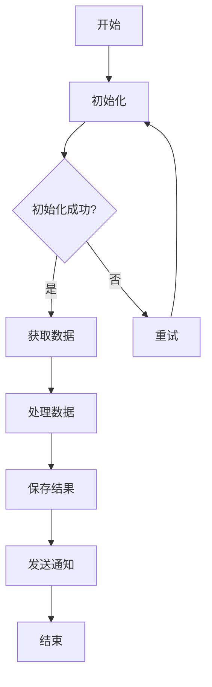

# RPA项目实施方法指导

> 基于UiBot实施方法指导V3.0的完整RPA项目实施指南

## 📋 目录

- [实施方法概述](#实施方法概述)
- [项目生命周期](#项目生命周期)
- [各阶段详细指导](#各阶段详细指导)
- [企业级框架](#企业级框架)
- [最佳实践](#最佳实践)
- [文档模板](#文档模板)
- [案例参考](#案例参考)

---

## 实施方法概述

### RPA项目实施六阶段

```
需求 → 设计 → 编码 → 测试 → 上线 → 运维
 ↓      ↓      ↓      ↓      ↓      ↓
需求   整体   流程   单元   部署   监控
分析   设计   开发   测试   上线   维护
```

### 实施方法特点

- ✅ **标准化流程**：六个标准阶段，确保项目质量
- ✅ **文档模板**：每个阶段提供标准文档模板
- ✅ **企业级框架**：REFramework和自定义框架
- ✅ **最佳实践**：基于真实项目的经验总结
- ✅ **案例参考**：提供完整的Demo案例

---

## 项目生命周期

### 阶段1：需求（Requirement）

**目标**：明确自动化需求，评估可行性

**主要活动**：
1. 需求调研与分析
2. 流程梳理与优化
3. 可行性评估
4. 需求文档编写

**交付物**：
- 需求说明书
- 流程需求说明
- 需求变更表

**关键指标**：
- 流程复杂度评估
- 自动化收益评估
- 技术可行性评估

### 阶段2：设计（Design）

**目标**：设计流程架构和技术方案

**主要活动**：
1. 整体架构设计
2. 流程详细设计
3. 异常处理设计
4. 数据流设计

**交付物**：
- 整体设计文档
- 流程设计文档
- 流程图（Visio）

**设计原则**：
- 模块化设计
- 异常处理完善
- 配置化管理
- 可扩展性

### 阶段3：编码（Development）

**目标**：实现自动化流程

**主要活动**：
1. 环境搭建
2. 流程开发
3. 代码评审
4. 单元测试

**交付物**：
- 流程代码
- 配置文件
- 代码评审记录

**开发规范**：
- 命名规范
- 注释规范
- 异常处理规范
- 日志记录规范

### 阶段4：测试（Testing）

**目标**：确保流程质量和稳定性

**主要活动**：
1. 单元测试
2. 系统集成测试
3. UAT用户验收测试
4. 性能测试

**交付物**：
- 单元测试报告
- 系统集成测试报告
- UAT测试报告

**测试类型**：
- 功能测试
- 异常测试
- 性能测试
- 兼容性测试

### 阶段5：上线（Deployment）

**目标**：部署到生产环境

**主要活动**：
1. 部署环境准备
2. 流程部署
3. 用户培训
4. 试运行

**交付物**：
- 部署清单
- 用户手册
- 培训材料

**上线检查**：
- 环境检查
- 配置检查
- 权限检查
- 备份检查

### 阶段6：运维（Operation）

**目标**：保障流程稳定运行

**主要活动**：
1. 日常监控
2. 问题处理
3. 性能优化
4. 版本升级

**交付物**：
- 运维手册
- 监控报告
- 问题处理记录

**运维指标**：
- 成功率
- 执行时长
- 异常次数
- 资源使用率

---

## 各阶段详细指导

### 1. 需求阶段详细指导

#### 1.1 需求调研

**调研内容**：
```
业务流程
├── 流程步骤
├── 操作系统/应用
├── 数据来源
├── 数据输出
└── 异常情况
```

**调研方法**：
- 访谈业务人员
- 观察实际操作
- 收集业务文档
- 分析历史数据

#### 1.2 流程梳理

**梳理要点**：
1. **流程步骤**：详细记录每个操作步骤
2. **判断条件**：记录所有判断逻辑
3. **异常情况**：识别可能的异常场景
4. **数据流转**：明确数据的输入输出

**流程图绘制**：
```
开始 → 步骤1 → 判断 → 步骤2 → 结束
              ↓
            异常处理
```

#### 1.3 可行性评估

**评估维度**：

| 维度 | 评估内容 | 评分标准 |
|------|---------|---------|
| 技术可行性 | 系统兼容性、技术难度 | 1-5分 |
| 业务价值 | 节省时间、减少错误 | 1-5分 |
| 实施难度 | 开发周期、资源需求 | 1-5分 |
| 投资回报 | 成本收益比 | 1-5分 |

**评估结论**：
- 高优先级：总分 > 16分
- 中优先级：总分 12-16分
- 低优先级：总分 < 12分

#### 1.4 需求文档编写

**需求说明书结构**：
```markdown
1. 项目概述
2. 业务背景
3. 流程现状
4. 自动化需求
5. 功能需求
6. 非功能需求
7. 约束条件
8. 验收标准
```

### 2. 设计阶段详细指导

#### 2.1 整体架构设计

**架构设计要素**：
```
整体架构
├── 流程架构
│   ├── 主流程
│   ├── 子流程
│   └── 公共模块
├── 数据架构
│   ├── 输入数据
│   ├── 中间数据
│   └── 输出数据
├── 异常架构
│   ├── 业务异常
│   ├── 系统异常
│   └── 异常恢复
└── 配置架构
    ├── 业务配置
    ├── 系统配置
    └── 环境配置
```

**架构模式选择**：

1. **REFramework模式**（推荐）
   - 适用：批量数据处理
   - 特点：标准化、可靠性高
   - 组件：初始化、获取数据、处理数据、结束

2. **线性流程模式**
   - 适用：简单顺序流程
   - 特点：开发快速、易维护
   - 组件：步骤1 → 步骤2 → 步骤3

3. **状态机模式**
   - 适用：复杂业务逻辑
   - 特点：灵活、可扩展
   - 组件：状态定义、状态转换、状态处理

#### 2.2 流程详细设计

**设计内容**：
```
流程设计
├── 流程步骤
│   ├── 步骤名称
│   ├── 步骤说明
│   ├── 输入参数
│   ├── 输出结果
│   └── 异常处理
├── 数据处理
│   ├── 数据验证
│   ├── 数据转换
│   └── 数据存储
└── 异常处理
    ├── 异常类型
    ├── 处理策略
    └── 恢复机制
```

**流程图示例**：


### 3. 编码阶段详细指导

#### 3.1 开发环境搭建

**环境清单**：
- UiBot Creator（开发工具）
- 目标应用系统
- 数据库（如需要）
- 版本控制工具（Git）

#### 3.2 编码规范

**命名规范**：
```vb
// 全局变量：g_ 前缀
Dim g_dictConfig = {}
Dim g_iRetryCount = 0

// 局部变量：驼峰命名
Dim strUserName = ""
Dim objExcelBook = ""
Dim arrData = []

// 函数名：帕斯卡命名
Function InitializeConfig()
Function ProcessData(data)
Function SendEmail(to, subject, body)
```

**注释规范**：
```vb
/*
作者：张三
创建时间：2024年01月01日
功能说明：本模块用于处理XXX业务
修改记录：
  2024-01-15 李四 修改了XXX功能
*/

/*1.初始化配置*/
// 读取配置文件
// 设置日志级别

/*2.处理数据*/
// 验证数据格式
// 转换数据类型
```

#### 3.3 代码结构

**标准项目结构**：
```
项目名称/
├── 主流程.flow              # 主流程文件
├── 初始化.task              # 初始化模块
├── 业务处理.task            # 业务处理模块
├── 异常处理.task            # 异常处理模块
├── PublicBlock.task         # 公共函数库
├── res/                     # 资源文件
│   ├── config/             # 配置文件
│   │   ├── Config.ini      # 配置参数
│   │   └── Config.xlsx     # Excel配置
│   ├── data/               # 数据文件
│   └── images/             # 图像资源
└── log/                    # 日志目录
```

### 4. 测试阶段详细指导

#### 4.1 单元测试

**测试内容**：
- 每个模块独立测试
- 验证输入输出
- 测试异常处理
- 测试边界条件

**测试用例模板**：
```
测试用例ID: TC001
测试模块: 数据处理模块
测试场景: 正常数据处理
前置条件: 配置文件正确，数据格式正确
测试步骤:
  1. 输入测试数据
  2. 执行处理函数
  3. 验证输出结果
预期结果: 数据处理成功，输出符合预期
实际结果: [填写]
测试结果: [通过/失败]
```

#### 4.2 系统集成测试

**测试内容**：
- 端到端流程测试
- 模块间集成测试
- 数据流转测试
- 异常场景测试

#### 4.3 UAT用户验收测试

**测试内容**：
- 业务场景验证
- 用户操作验证
- 结果准确性验证
- 性能验证

### 5. 上线阶段详细指导

#### 5.1 部署清单

**部署前检查**：
```
环境检查
├── 操作系统版本
├── UiBot版本
├── 目标应用版本
├── 数据库连接
└── 网络连接

配置检查
├── Config.ini配置
├── 邮件配置
├── 数据库配置
└── 日志配置

权限检查
├── 文件读写权限
├── 应用访问权限
├── 数据库权限
└── 网络访问权限
```

#### 5.2 用户手册

**手册结构**：
```markdown
1. 系统概述
2. 使用前准备
3. 操作步骤
4. 常见问题
5. 联系方式
```

### 6. 运维阶段详细指导

#### 6.1 监控指标

**关键指标**：
```
性能指标
├── 执行成功率
├── 平均执行时长
├── 异常次数
└── 资源使用率

业务指标
├── 处理数据量
├── 节省时间
├── 错误率
└── 用户满意度
```

#### 6.2 问题处理流程

```
问题发现 → 问题分析 → 解决方案 → 实施修复 → 验证结果
    ↓          ↓          ↓          ↓          ↓
  监控告警   日志分析   制定方案   代码修改   测试验证
```

---

## 企业级框架

### REFramework（推荐）

**框架结构**：
```
REFramework
├── 初始化（Init）
│   ├── 读取配置
│   ├── 初始化应用
│   └── 初始化日志
├── 获取数据（Get Transaction Data）
│   ├── 从队列获取
│   ├── 从数据库获取
│   └── 从Excel获取
├── 处理数据（Process Transaction）
│   ├── 业务处理
│   ├── 异常处理
│   └── 结果记录
└── 结束（End Process）
    ├── 关闭应用
    ├── 生成报告
    └── 发送通知
```

**适用场景**：
- 批量数据处理
- 需要事务管理
- 需要重试机制
- 需要详细日志

### 自定义框架

**框架特点**：
- 更灵活的流程控制
- 简化的配置管理
- 轻量级实现
- 快速开发

**适用场景**：
- 简单流程
- 快速开发
- 特殊需求

---

## 最佳实践

### 1. 项目管理最佳实践

**项目计划**：
```
阶段      工作量占比    关键活动
需求      15%         需求调研、可行性评估
设计      20%         架构设计、流程设计
编码      30%         流程开发、代码评审
测试      20%         单元测试、集成测试、UAT
上线      10%         部署、培训、试运行
运维      5%          监控、维护、优化
```

### 2. 开发最佳实践

**代码质量**：
- ✅ 模块化设计
- ✅ 异常处理完善
- ✅ 日志记录详细
- ✅ 配置化管理
- ✅ 代码注释清晰

**性能优化**：
- ✅ 减少不必要的等待
- ✅ 优化元素定位
- ✅ 合理使用缓存
- ✅ 及时释放资源

### 3. 测试最佳实践

**测试策略**：
- ✅ 单元测试覆盖率 > 80%
- ✅ 集成测试覆盖主要场景
- ✅ UAT测试由业务人员参与
- ✅ 性能测试验证关键指标

### 4. 运维最佳实践

**监控告警**：
- ✅ 实时监控执行状态
- ✅ 异常自动告警
- ✅ 定期生成报告
- ✅ 持续优化改进

---

## 文档模板

### 需求阶段模板

1. **需求说明书模板**
2. **流程需求说明模板**
3. **需求变更表模板**

### 设计阶段模板

1. **整体设计文档模板**
2. **流程设计文档模板**
3. **流程图模板（Visio）**

### 编码阶段模板

1. **代码评审表模板**
2. **开发规范文档**

### 测试阶段模板

1. **单元测试用例模板**
2. **系统集成测试用例模板**
3. **UAT测试用例模板**

### 上线阶段模板

1. **部署清单模板**
2. **用户手册模板**

### 运维阶段模板

1. **运维手册模板**
2. **问题处理记录模板**

---

## 案例参考

### 案例1：书籍价格比对

**业务场景**：
根据书籍名，在当当网和京东网搜索价格，发送最低价格信息到邮箱

**技术要点**：
- Web自动化
- 数据对比
- 邮件发送

**参考位置**：
`UiBot实施方法指导V3.0/企业级框架/UiBot企业级流程模板Demo/`

### 案例2：机票查询系统

**业务场景**：
从南航、东航、携程采集机票数据，对比价格，生成Excel报告

**技术要点**：
- 多数据源采集
- 智能价格对比
- Excel自动化
- 天气API集成

**参考位置**：
`剑气高级案例/北京玖卓科技_张建琦_15801023818/`

---

## 快速开始

### 使用项目模板

```bash
# 生成完整项目结构
python tools/project-template-generator.py -t rpa_project \
  -p '{"project_name":"我的RPA项目","author":"张三"}' \
  -o MyRPAProject
```

### 使用文档模板

```bash
# 生成需求文档
python tools/doc-template-generator.py -t requirement \
  -p '{"project_name":"我的RPA项目"}' \
  -o 需求说明书.docx
```

---

## 总结

RPA项目实施方法指导提供了从需求到运维的完整流程规范，包括：

✅ **标准化流程**：六个阶段的详细指导  
✅ **文档模板**：每个阶段的标准文档  
✅ **企业级框架**：REFramework和自定义框架  
✅ **最佳实践**：基于真实项目的经验  
✅ **案例参考**：完整的Demo案例

通过遵循本指导，可以确保RPA项目的质量和成功率。

---

**文档版本**：v1.0  
**更新时间**：2026-05-02  
**基于**：UiBot实施方法指导V3.0  
**适用版本**：UiBot 6.0+
